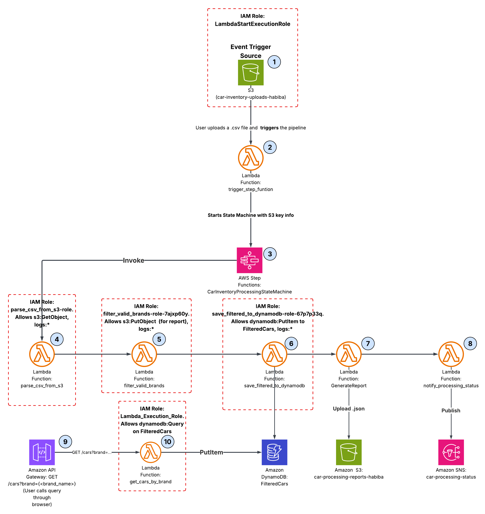

# AWS 서버리스 주문 처리 파이프라인

[English](README.md) · **한국어**

[](https://github.com/engineerinn/aws-serverless-order-pipeline/actions/workflows/deploy.yml)


주문 CSV 파일을 S3에 업로드하면, 파이프라인이 모든 행을 검증하고 가공한 뒤 DynamoDB에 저장하고, 원본 파일을 아카이빙한 다음 처리 결과를 이메일로 발송합니다. 하루에 한 번 테이블 전체를 S3로 내보내므로 Athena에서 SQL로 조회할 수 있습니다.

전 구간 서버리스이며, 모든 인프라는 Terraform으로 정의되어 있고, GitHub Actions가 장기 유효 AWS 액세스 키 없이 배포합니다.

---

## 한눈에 보기

| | |
|---|---|
| **해결하는 문제** | 배치 주문 파일의 검증·가공·저장·분석을 서버 운영 부담 없이 처리 |
| **접근 방식** | 이벤트 기반 파이프라인: S3 → Lambda → Step Functions → DynamoDB → S3 → SNS, 여기에 일일 분석 익스포트와 조회 API를 추가 |
| **기술 스택** | Python 3.12 · Terraform · Step Functions · Lambda · DynamoDB · S3 · SNS · SQS · EventBridge · API Gateway · Glue · Athena · CloudWatch |
| **규모** | Lambda 8개, 5단계 워크플로우, Terraform 구성 파일 4종, 단위 테스트 70개 |
| **CI/CD** | GitHub Actions — 모든 PR에서 테스트와 `terraform validate` 실행, `main` 병합 시 OIDC 인증 기반 apply |
| **유휴 비용** | 약 $0. 전부 요청당 과금이며, S3 스토리지와 14일 로그 보관만 고정 비용으로 발생 |

---

## 아키텍처



```
S3에 CSV 업로드 (raw-orders 버킷, .csv 필터)
      │
      ▼
trigger_pipeline ──start_execution──▶ Step Functions
                                          │
   ┌──────────────┬───────────────┬───────┴────────┬────────────────┐
   ▼              ▼               ▼                ▼                ▼
ParseAndValidate  EnrichOrders  SaveToDynamoDB  ArchiveToS3   NotifySuccess
 CSV → 행 변환     합계·ID 부여    orders 테이블   아카이브 버킷   SNS 이메일

   States.ALL 오류 발생 시 ──▶ NotifyFailure ──▶ PipelineFailed

보조 경로 (상태 머신 외부)
   EventBridge (매일 00:00 UTC) ──▶ export_to_s3_for_athena ──▶ S3 + Glue + Athena
   API Gateway GET /orders      ──▶ get_orders_by_status_or_date ──▶ DynamoDB GSI
```

### 이렇게 설계한 이유

가장 고민이 많았던 설계 결정들입니다. 각 항목은 그렇게 하지 않았다면 실제로 발생했을 문제에 대응합니다.

**아카이브 버킷을 랜딩 버킷과 분리했습니다.**
파이프라인을 트리거하는 버킷에 아카이브를 다시 쓰면, 파이프라인이 자기 출력물을 다시 입력으로 소비하는 무한 루프가 발생하고 그 호출 비용이 그대로 청구됩니다. 버킷을 둘로 나누고 알림에 `.csv` 접미사 필터를 걸어, 이 상황이 "일어나기 어려운" 수준이 아니라 구조적으로 불가능하도록 만들었습니다.

**`archive_to_s3`는 축소된 이벤트를 반환합니다.**
Step Functions의 상태 페이로드 상한은 256KB입니다. 마지막 전이 직전에 행 배열을 제거해, 큰 파일을 처리할 때 실제 작업이 모두 성공한 뒤 마지막 단계에서 파이프라인이 실패하는 일을 방지합니다. `summary`는 ASL의 `Parameters` 블록이 `$.summary`를 참조하므로 축소 대상에서 제외했습니다.

**Lambda마다 IAM 역할을 하나씩 두고, `enrich_orders`에는 로깅 외 권한을 주지 않았습니다.**
각 함수의 정책은 실제로 접근하는 리소스만 명시합니다. `enrich_orders`는 순수 연산 함수로, 이벤트를 읽어 계산한 뒤 반환할 뿐입니다. "일관성을 위해" 테이블 정책을 붙이는 것은 아무도 필요로 하지 않는 권한을 부여하는 일입니다.

**Lambda 리소스를 `for_each` 대신 개별 선언했습니다.**
`trigger_pipeline`은 상태 머신에 의존하고, 상태 머신은 나머지 다섯 개 함수에 의존합니다. 이를 하나의 `for_each` 리소스로 묶으면 Terraform이 플랜을 세울 수 없는 리소스 단위 순환 의존이 생깁니다.

**숫자는 `Decimal(str(v))`를 거쳐 DynamoDB에 저장합니다.**
DynamoDB는 네이티브 float를 허용하지 않습니다. `Decimal(float)`가 아니라 `str`을 거치도록 해서, 이진 부동소수점 오차가 저장된 가격 데이터에 그대로 옮겨붙는 것을 막았습니다.

**Athena 익스포트는 JSON 배열이 아니라 개행 구분 JSON(NDJSON)입니다.**
Athena의 JSON SerDe는 한 줄에 하나의 객체를 파싱합니다. 정수형 `Decimal`은 `int`로 되돌려, Glue가 `string`이 아닌 `bigint`로 타입을 추론하도록 했습니다.

**모든 태스크에 재시도를, 워크플로우 전체에 catch-all을 두었습니다.**
일시적 Lambda 오류는 백오프와 함께 재시도합니다. 그 외 모든 오류는 `NotifyFailure → PipelineFailed`로 라우팅되므로, 실패는 조용한 정지가 아니라 반드시 이메일로 통지됩니다.

**CI는 액세스 키가 아닌 OIDC로 배포합니다.**
GitHub Actions가 단기 OIDC 토큰을 임시 AWS 자격 증명으로 교환합니다. 유출되거나 로테이션해야 할 정적 시크릿 자체가 존재하지 않습니다. 배포 역할은 별도의 `bootstrap/` 루트 모듈에서 프로비저닝하므로, 파이프라인이 같은 apply 안에서 자기 권한을 스스로 확대할 수 없습니다.

---

## 사용한 AWS 서비스와 각각의 역할

| 서비스 | 이 프로젝트에서의 역할 |
|---|---|
| **S3** | 버킷 3개: `raw-orders`(랜딩 존, 파이프라인 트리거), `archive`(날짜 파티션 CSV + processed/rejected JSON), `analytics`(Athena용 일일 익스포트) |
| **Lambda** | Python 3.12 함수 8개 — 워크플로우 5단계, S3 트리거 1개, 일일 익스포터 1개, API 핸들러 1개 |
| **Step Functions** | 워크플로우 5단계를 오케스트레이션. 태스크별 재시도·백오프와 `States.ALL` 실패 분기 포함. ASL로 정의하고 Terraform `templatefile()`로 렌더링 |
| **DynamoDB** | `orders` 테이블. 해시 키는 `order_id`, 조회 API를 뒷받침하는 `status-date-index`·`customer-date-index` GSI 보유 |
| **SQS** | 비동기 호출되는 Lambda 2개의 데드 레터 큐. 실패한 비동기 호출을 유실 대신 보관 (14일 보관) |
| **SNS** | 파이프라인 성공·실패 시 이메일 알림 |
| **EventBridge** | 매일 00:00 UTC에 분석 익스포트를 실행하는 스케줄 |
| **API Gateway** | `GET /orders`를 노출하는 REST API. API 키로 보호되며 10 rps / 버스트 20, 월 10,000건 쿼터로 스로틀링 |
| **Glue** | 카탈로그 데이터베이스와 크롤러(01:00 UTC). Athena 테이블 스키마를 익스포트된 데이터와 동기화 |
| **Athena** | 익스포트된 주문 데이터에 대한 SQL 조회. 전용 워크그룹이 쿼리당 스캔량을 1GB로 제한해, 실수로 실행한 `SELECT *`가 비용을 폭증시키지 못하도록 함 |
| **CloudWatch** | 함수별 로그 그룹(14일 보관), `local.functions` 순회로 생성되는 대시보드, `ExecutionsFailed > 2` 및 DLQ 적재량 `> 0` 경보 |
| **IAM** | Lambda별 최소 권한 실행 역할, 그리고 GitHub Actions가 OIDC로 assume하는 배포 역할 |

### IaC — Terraform

위의 모든 리소스는 `infra/terraform/`에 선언되어 있으며, 콘솔에서 수동으로 만든 것은 하나도 없습니다. 덕분에 전체 스택을 파기했다가 동일하게 재생성할 수 있고, 변경 사항을 풀 리퀘스트에서 diff로 리뷰할 수 있으며, AWS에 도달하기 전에 CI에서 검증할 수 있습니다.

Lambda 패키징은 플랜 시점의 `data.archive_file`이 처리하므로 별도 빌드 단계가 없습니다. 테스트 파일과 `__pycache__`는 zip에서 제외되므로, 테스트를 실행해도 `source_code_hash`가 바뀌어 불필요한 재배포가 유발되지 않습니다.

### CI/CD — GitHub Actions

`.github/workflows/deploy.yml`은 세 개의 잡을 실행합니다.

1. **단위 테스트** — Lambda 8개 전체에 대해 `pytest` 실행
2. **Terraform 검증** — `fmt -check -recursive` 후, 메인 구성과 `bootstrap/` 루트 모듈 각각에 `init -backend=false && validate`
3. **Apply** — `main` 브랜치 푸시에서만, 보호된 `production` 환경의 승인을 거쳐 OIDC 인증으로 실행

풀 리퀘스트에서는 1·2단계만 실행됩니다. 두 단계를 모두 통과하지 않으면 어떤 변경도 AWS에 반영되지 않습니다.

---

## 주요 기능

- 행 단위 CSV 검증 — 잘못된 행마다 사유를 타입으로 분류해 기록
- 단계별 재시도·백오프와 전역 실패 분기를 갖춘 오케스트레이션 워크플로우
- Lambda별 IAM 역할 분리, 각각 실제로 접근하는 리소스로만 범위 한정
- 비동기 호출 함수 2개에 대한 데드 레터 큐
- 날짜 파티션 아카이브와 수명 주기 티어링 — 30일 후 Standard-IA, 90일 후 Glacier IR
- 날짜 기준 Hive 파티셔닝된 NDJSON 형식의 일일 Athena 익스포트
- DynamoDB GSI 기반 조회 API — 상태별 또는 고객별, 날짜 범위 선택 지정 가능
- CloudWatch 대시보드 및 실행 실패·DLQ 적재량 경보
- 단위 테스트 70개. AWS 호출 없이 약 2초 만에 실행되며 모든 푸시마다 수행

---

## 시작하기

### 사전 요구 사항

- Terraform >= 1.6, Python 3.12
- 위 리소스를 생성할 권한이 있는 AWS 자격 증명

### 배포

```bash
cd infra/terraform
terraform init
terraform apply -var="alert_email=you@example.com"
```

기본 리전은 `ap-southeast-2`이며, `-var="aws_region=..."`로 변경할 수 있습니다.

최초 apply 이후 **SNS 구독 확인 이메일의 링크를 반드시 클릭하세요.** 확인 전까지 AWS는 알림을 발송하지 않습니다.

### 실행해 보기

```bash
aws s3 cp lambdas/sample_data/order_sample.csv \
  "s3://$(terraform -chdir=infra/terraform output -raw raw_orders_bucket)/"
```

Step Functions 콘솔에서 실행 과정을 확인한 뒤, 받은 편지함을 열어 보세요.

### 리소스 정리

```bash
terraform destroy
```

S3 버킷은 먼저 비워야 합니다 — 각 버킷에 대해 `aws s3 rm s3://<bucket> --recursive`를 실행하세요.

---

## API 레퍼런스

`GET /orders` — 최신 주문부터 반환합니다. **`x-api-key` 헤더가 필요합니다.**

| 파라미터 | 필수 여부 | 설명 |
|---|---|---|
| `status` | 둘 중 하나 필수 | `pending`, `processing`, `shipped`, `delivered`, `cancelled` |
| `customer_id` | 둘 중 하나 필수 | 정확히 일치, 예: `CUST-123` |
| `start_date` | 선택 | `YYYY-MM-DD`, 해당일 포함 |
| `end_date` | 선택 | `YYYY-MM-DD`, 해당일 포함 |
| `limit` | 선택 | 1–500, 기본값 100 |

```bash
API=$(terraform -chdir=infra/terraform output -raw orders_api_endpoint)
KEY=$(terraform -chdir=infra/terraform output -raw orders_api_key)

curl -H "x-api-key: $KEY" "$API?status=pending&limit=10"
curl -H "x-api-key: $KEY" "$API?customer_id=CUST-123&start_date=2024-01-01&end_date=2024-01-31"
```

```json
{
  "count": 2,
  "index": "status-date-index",
  "orders": [{ "order_id": "ORD-002", "total_value": 34.99, "...": "..." }],
  "has_more": false
}
```

호출자가 수정할 수 있는 잘못된 입력은 `{"error": "..."}` 본문과 함께 `400`을 반환합니다. 키가 없거나 유효하지 않으면 `403`을 반환합니다.

---

## Athena로 조회하기

익스포트 Lambda는 `s3://<analytics-bucket>/analytics/export_date=YYYY-MM-DD/orders.json` 경로에 데이터를 씁니다. Glue 크롤러가 한 시간 뒤 실행되어 테이블 스키마를 동기화합니다.

```sql
SELECT status, COUNT(*) AS orders, SUM(total_value) AS revenue
FROM order_pipeline_analytics.analytics
WHERE export_date = current_date
GROUP BY status
ORDER BY revenue DESC;
```

Athena 콘솔에서 `order-pipeline-workgroup` 워크그룹을 선택하세요. 쿼리당 스캔량이 1GB로 제한됩니다.

---

## 테스트

```bash
pip install -r requirements-dev.txt
pytest
```

테스트 70개, AWS 호출 없음, `moto` 미사용 — 오프라인에서 약 2초면 끝납니다. 모든 Lambda의 순수 로직을 다룹니다: 검증 규칙, 가공 연산, DynamoDB 타입 변환, 아카이브 키 구조, 알림 렌더링, 쿼리 빌더.

모든 Lambda 폴더에 `lambda_function.py`라는 같은 이름의 파일이 있어, 그냥 `import lambda_function`을 하면 Python이 먼저 캐시한 모듈이 잡히고 테스트가 엉뚱한 모듈을 조용히 검사하게 됩니다. `conftest.py`의 `lambda_module` 픽스처가 각 파일을 고유한 모듈 이름으로 로드해 이 문제를 해결합니다.

```python
def test_something(lambda_module):
    save = lambda_module("save_to_dynamodb")
    ...
```

`pytest.ini`에는 `--import-mode=importlib`를 설정해, 이름이 같은 `test_lambda_function.py` 파일 8개가 서로 충돌하지 않도록 했습니다.

---

## 저장소 구조

```
lambdas/
  trigger_pipeline/              S3 이벤트 → start_execution
  parse_and_validate_orders/     CSV → 검증된 행
  enrich_orders/                 total_value, processed_at, pipeline_run_id
  save_to_dynamodb/              orders 테이블 배치 쓰기
  archive_to_s3/                 CSV 이동, processed/rejected JSON 저장
  notify_via_sns/                성공·실패 이메일
  export_to_s3_for_athena/       일일 DynamoDB → S3 익스포트
  get_orders_by_status_or_date/  API Gateway 핸들러
  step_function/                 ASL 정의 (Terraform이 렌더링)
  sample_data/                   예시 CSV
infra/terraform/
  main.tf        프로바이더, 버킷, DynamoDB, SQS, SNS
  lambdas.tf     함수, IAM, Step Functions, API Gateway
  analytics.tf   EventBridge, Glue, Athena
  monitoring.tf  대시보드와 경보
  variables.tf   입력 변수
  bootstrap/     OIDC 프로바이더와 배포 역할 (최초 1회 별도 apply)
.github/workflows/
  deploy.yml     test → validate → apply
```

---

## 비용

전부 요청당 과금이므로 유휴 상태의 비용은 사실상 0입니다. 고정적으로 발생하는 비용은 S3 스토리지(90일 후 Glacier IR로 티어 다운)와 최대 14일로 제한한 CloudWatch 로그 보관뿐입니다.

---

## 라이선스

MIT — [LICENSE](LICENSE) 참조.
